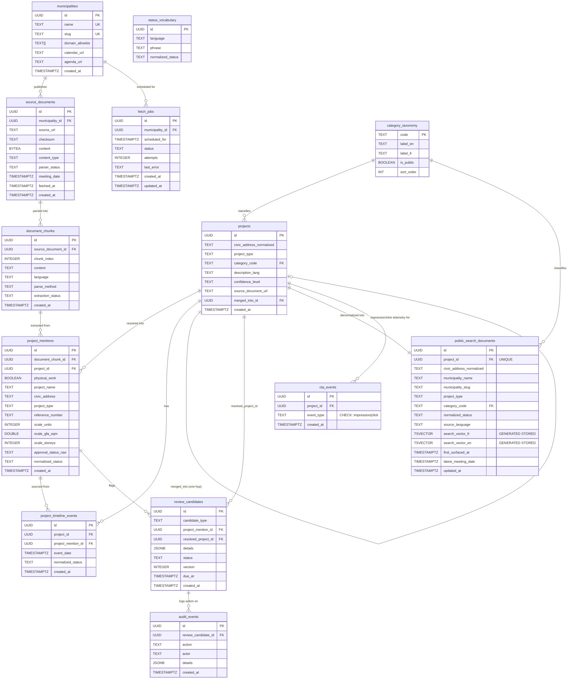

# Entity-Relationship Diagram — ShovelsUp (apps/web)

Reflects the schema as of migration `026_cta_events.sql` (the latest applied migration at
time of writing). Reconstructed by reading every file in `apps/web/web/migrations/` — not
inferred from application code.

No pre-existing ERD convention was found elsewhere in `docs/`; this uses Mermaid
`erDiagram` syntax, which GitHub renders natively with no external tooling.

## Migration numbering gap (016)

There is no `016_*.sql` file, and the sequence jumps from `015_montreal_agenda_url.sql`
to `017_public_search_municipality_slug.sql`. This is **not an unexplained gap** — the
migrations that immediately follow it document the reason inline. Migration
`018_public_search_bilingual.sql`'s header comment states:

> "016 does not exist in this tree yet — REQ-013's migration hasn't shipped in this
> execution order — so there is no collision; 018 is the actual next free number."

and `019_public_search_first_surfaced_at.sql` repeats the same note. In other words, `016`
was reserved in the Implementation Plan's numbering scheme for REQ-013 (the project-merge
feature), but REQ-013 was implemented later than originally sequenced and its migration
ultimately landed as `025_project_merged_into_id.sql` instead of `016`. Nothing ever
reclaimed `016` for a different purpose, so the number is simply unused — a planning
artifact of out-of-order requirement delivery, not a sign of a deleted or lost migration.

## Source-of-truth vs. denormalized read-model tables

Every table below except `public_search_documents` is a source-of-truth table — it is
the only place its data lives, and nothing else independently reconstructs it.
`public_search_documents` is a **denormalized read-model**, deliberately kept separate
from `project_mentions`/`projects` (migration 013's own stated rationale) so that PII
and internal-only fields (reference numbers, raw LLM output, review state) are
structurally impossible to leak through the public, unauthenticated search API — the
table only ever contains the subset of fields safe to expose. It is kept in sync by
`web/src/jobs/public_search_refresh.rs`, which mirrors fields from `projects`,
`project_mentions`, `document_chunks`, `project_timeline_events`, and
`category_taxonomy` on a schedule (the same in-process interval-loop pattern as the
fetch pipeline, ADR 006) — it is never written to directly by request-handling code.

## Notes on specific columns

- **`projects.merged_into_id`** (migration 025, ADR 010) — nullable, self-referencing FK
  to `projects.id`, `ON DELETE SET NULL`. A database trigger
  (`enforce_projects_merged_into_one_hop`) enforces that a merge chain is never more than
  one hop deep (A → B is fine; A → B → C is rejected), since that invariant requires
  looking at other rows and cannot be expressed as a plain `CHECK` constraint.
- **`projects.category_code`** / **`public_search_documents.category_code`** (migrations
  022/023) — both reference `category_taxonomy.code`. `category_taxonomy` is a small,
  hand-curated public-facing vocabulary (`residential`, `commercial`, `institutional`,
  `infrastructure`, `other`), deliberately distinct from the pipeline's free-text
  `project_mentions.project_type`/`projects.project_type` (which is whatever text an LLM
  extraction returns, e.g. "résidentiel", "mixed-use" — no fixed enum backs it).
- **`public_search_documents.municipality_slug`/`source_language`/`first_surfaced_at`/
  `latest_meeting_date`** (migrations 017, 018, 019, 024) — all denormalized/derived
  columns mirrored from the source-of-truth tables by
  `web/src/jobs/public_search_refresh.rs`, not written by request handlers.
  `first_surfaced_at` is set once on first insert and never touched again by later
  refreshes. `latest_meeting_date` is `MAX(project_timeline_events.event_date)` for the
  project, indexed `DESC NULLS LAST` to serve `sort=date` directly.
- **`public_search_documents.search_vector_fr`/`search_vector_en`** — Postgres
  `GENERATED ALWAYS ... STORED` `tsvector` columns built from
  `civic_address_normalized || municipality_name`, kept in sync automatically by Postgres
  itself on every write (no application code needs to remember to update them).
- **Unique constraints of note**: `projects(civic_address_normalized, project_type)`
  (partial, where both are non-null) prevents duplicate resolved projects outside the
  review/ambiguous-match path; `public_search_documents.project_id` is `UNIQUE` (one
  search-index row per project); `source_documents(municipality_id, checksum)` is
  `UNIQUE` (dedupes re-fetches of identical content); `document_chunks(source_document_id,
  chunk_index)` is `UNIQUE`; `status_vocabulary(language, phrase)` is `UNIQUE`.
- **`cta_events`** (migration 026, ADR 011) — write-mostly telemetry sink for the project
  detail page's non-modal upsell CTA card; one row per `impression` (page load) or `click`
  (signup link followed) beacon, `event_type` constrained by a `CHECK` to that fixed pair.
  `ON DELETE CASCADE` on `project_id`, since an event is meaningless once its project no
  longer exists. Has no downstream reader in this pass — it exists for future
  analysis, not a live feature.
